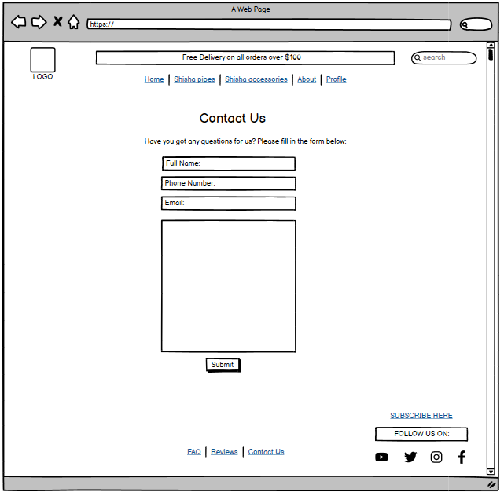
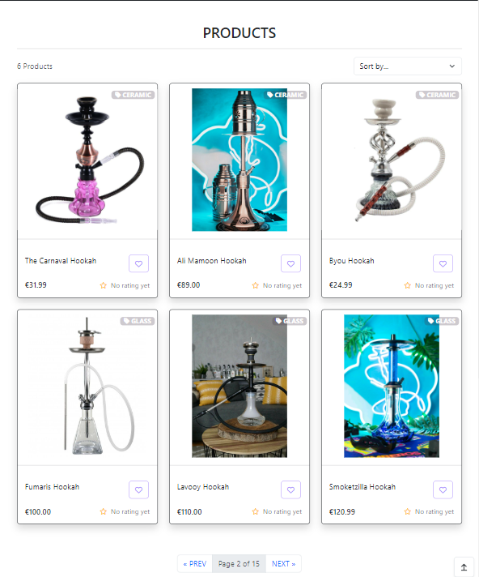
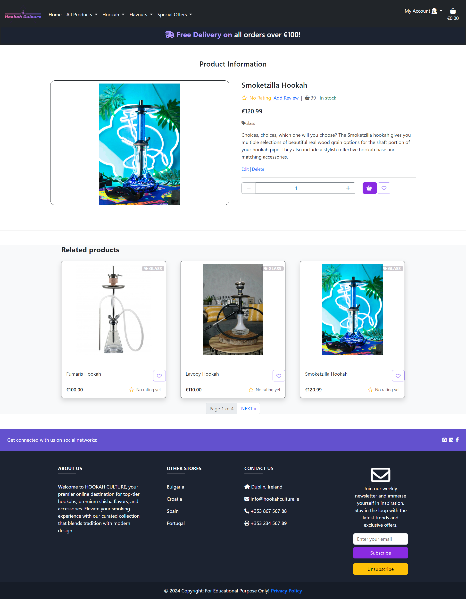

# Hookah Culture


Welcome to Hookah Culture, where the art of hookah transcends beyond a mere pastime, transforming into a captivating experience that blends tradition with modernity. Rooted in a passion for quality, community, and exploration, Hookah Culture is your premier destination for all things hookah. At Hookah Culture, we curate a diverse selection of premium hookahs, accessories, and flavors, each chosen with meticulous care to cater to the diverse tastes and preferences of our discerning clientele. Our mission is to not only provide top-notch products but to also foster a vibrant community where hookah enthusiasts can connect, share, and embark on a journey into the heart of hookah culture. Join us on this journey, and let Hookah Culture be your trusted companion in exploring the captivating world of hookah enjoyment.

Visit the deployed website [here]().

<br>
<hr>
<br>

## Table of Contents

1. [User Experience (UX)](#user-experience-ux)
    1. [Strategy](#strategy)
        1. [Project Goals](#project-goals)
        2. [User Goals](#user-goals)
        3. [Strategy Table](#strategy-table)
    2. [Scope](#scope)
        1. [User Stories](#user-stories)
    3. [Structure](#structure)
        1. [Database Model](#database-model)
    4. [Skeleton](#skeleton)
        1. [Wireframes](#wireframes)
    5. [Surface](#surface)
        1. [Color Scheme](#color-scheme)
        2. [Typography](#typography)
2. [Marketing](#marketing)
   1. [Search Engine Optimisation](#search-engine-optimisation)
   2. [Business Model](#business-model)
3. [Features](#features)
   1. [Home Page](#home-page)
   2. [Products Page](#products-page)
   3. [Product Details Page](#product-details-page)
   4. [Products Admin](#products-admin)
   5. [Shopping Cart Page](#shopping-cart-page)
   6. [Checkout Page](#checkout-page)
   7. [Checkout Success Page](#checkout-success-page)
   8. [Profile Page](#profile-page)
   9. [Wishlist Page](#wishlist-page)
   10. [Reviews Page](#reviews-page)
   11. [Add Review](#add-review)
   12. [Edit Review](#edit-review)
   13. [Contact Us Page](#contact-us-page)
   14. [Accounts Pages](#accounts-pages)
   15. [404 Error Page](#404-error-page)
4. [Technologies Used](#technologies-used)
    1. [Languages Used](#languages-used)
    2. [Libraries and Frameworks](#libraries-and-frameworks)
    3. [Packages / Dependencies Installed](#packages--dependencies-installed)
    4. [Database Management](#database-management)
    5. [Payment Service](#payment-service)
    6. [Cloud Storage](#cloud-storage)
    7. [Tools and Programs](#tools-and-programs)
5. [Testing](#testing)
    1. [Go to TESTING.md](https://github.com/Delfinistkata/hookah_culture/blob/main/TESTING.md#hookah-culture-testing)
6. [Deployment](#deployment)
    1. [How To Use This Project](#how-to-use-this-project)  
    2. [Deployment to Heroku](#deployment-to-heroku)   
    3. [AWS Bucket Creation](#aws-bucket-creation)  
    4. [Connect Django to AWS Bucket](#connect-django-to-aws-bucket)
7. [Finished Product](#finished-product)
8. [Credits](#credits)
9. [Known Bugs](#known-bugs)
10. [Acknowledgements](#acknowledgements)

<br>

## User Experience (UX)

### Strategy

#### Project Goals

* Responsive design to make the website accessible on different screen sizes.

* Structure is easy to understand and navigates effortlessly for an easy shopping experience.

* The website desing and colors are appealing to the customers.

* Customers are offered the opportunity to register an account.

* Easy shopping process to create a pleaseant experince for the customer.

[Back to top ⇧](#hookah-culture)

#### User Goals

**Epic 1 - Shopping Experience**

* As a shopper, I want to easily find the products and their details.

* As a shopper, I want to view products on a specific category.

* As a shopper, I want to be able to sort the products depending on their price, rating or category.

* As a shopper, I want to be able to search for products using specific keywords.

* As a shopper, I want to easily select the quantity of products to be purchased.

* As a shopper, I want to easily view the current purchase amount.

**Epic 2 - Shopping Cart and Checkout**

* As a shopper, I want to view all items currently in my shopping cart and be able to update them.

* As a shopper, I want to easily provide my shipping and payment information during the checkout.

* As a shopper, I want to feel my personal and payment data is being handled securely.

* As a shopper, I want to receive an order confirmation once I have finished my purchase.

* As a shopper, I want to receive an order confirmation email for my records.

**Epic 3 - User Accounts**

* As a frequent shopper, I want to be able to register an account using my email address to be able to keep my records and interact with the website.

* As a frequent shopper, I want to receive a confirmation once my account has been registered to make sure the information entered was correctly.

* As a registered shopper, I want to easily log in and log out from my account.

* As a registered shopper, I want to be able to recover access to my account in case I forget my password.

* As a registered shopper, I want to have a personalized profile page where I can keep my contact information updated and see my past orders.

**Epic 4 - Product Reviews**

* As a shopper, I want to be able to read product reviews left by other shoppers.

* As a shopper, I want to be able to sort the reviews by date or rating.

* As a registered shopper, I want to be able to leave product reviews and rate the products.

**Epic 5 - Wishlist**

* As a registered shopper, I want to be able to keep a list of my favorite products to purchase again in the future.

* As a registered shopper, I want to be able to easily add and remove products from my wishlist.

**Epic 6 - Product Admin**

* As a site admin, I want to be able to add and update products.

* As a site admin, I want to be able to remove product no longer available.

**Epic 7 - Contact Us**

* As a site admin, I want to give the users the opportunity to contact the business owner if they have any questions.

**Epic 8 - Newsletter Subscription**

* As a site admin, I want shoppers to be able to provide their contact information to be able to reach out to them with information and offers.

[Back to top ⇧](#hookah-culture)

#### Strategy Table

Opportunity / Problem | Importance | Viability / Feasibility
--- | --- | ---
Responsive design | 5 | 5
Create, edit and delete products | 5 | 5
Account registration | 5 | 5
User profile | 5 | 5
Wishlist | 4 | 4
Save shipment information | 5 | 5
Product quick view | 3 | 2
Sort products by different criteria | 5 | 5
Search products by name or description | 5 | 5
Product details view | 5 | 5
Display similar products at the a product details view | 3 | 2
Rate products | 4 | 3
Write product reviews | 4 | 3
Display current purchase total | 5 | 5
View current shopping cart | 5 | 5
Edit quantities inside the shopping bag | 4 | 4
Shopping cart quick view | 3 | 3
Card payment | 5 | 5
Newsletter subscription | 5 | 5
**Total** | **85** | **81**

[Back to top ⇧](#hookah-culture)

### Scope

The project aims to develop an e-commerce website offering products to customers. The website will be responsive and user-friendly, providing the user with the ability to:

 - Register and Login
 - Reset Password
 - Browse, search and refine products
 - Add products to shopping cart
 - View product stock levels
 - Update quantity in shopping cart
 - Delete products from shopping cart
 - Pay for products securely by using the integrated Stripe payment system
 - Save products to wishlist
 - Update personal information
 - View past orders
 - Add review and rate products
 - Fill in a contact us form

Key Features:

1. Initial Project Setup:
- Developers can set up a new Django project to create the project's structure.
- Database and media storage will be connected to ensure data storage and retrieval.
- An early deployment of the application will be carried out to confirm the initial setup's functionality.
2. Products:
- Users can view products and refine them by all available categories.
- Users can sort products by price, title, or category.
- Users can view details about each product including image, description, price, stock level, reviews and rating.
- Search products by title or description.
- Registered users can leave reviews and ratings.
3. User Authentication:
- Users can register an account, allowing them access to all of the website's functionality.
- Registered users can login and access wishlist, reviews, past orders and saving personal details.
- Users can reset their password.
- Users can add or remove products from their wishlist.
- Users can add or edit products reviews.
4. Orders and checkout:
- Users can add products to their shopping cart.
- Users can update the quantity of the products in the shopping cart.
- Users can remove products from their shopping cart.
- Users can use secure checkout functionality to pay for their products.
5. Admin functionality:
The functionality in this section is limited to superusers or admins.
- Admins can add new products for sale.
- Admins can delete products from the system.
- Admins can edit products and stock levels.
- Admins can access Orders section, where the order status can be updated.
- Admins can sort orders by status (In Progress, Completed, Cancelled).
6. Notification Messages:
Users will receive notification messages when performing CRUD operations, login/logout, and signup actions.

<br>
<hr>
<br>

Benefits:

1. User-Centric Experience: The platform focuses on the user's needs, allowing efficient browsing and product purchasing.
2. Efficient Navigation: Users can easily navigate through different sections of the website for seamless access.
4. Effective Communication: Sending emails and notification messages features, enhances user interaction.

[Back to top ⇧](#hookah-culture)

#### User Stories

GitHub projects was used as my project management tool to track user stories. Using a Kanban board helped to focus on specific tasks and track the project progress.

1. As a Developer I can setup a new Django project so that I can create the project's structure.
2. As a Developer I can connect database and media storage so that the user's stored data is stored successfully.
3. As a Developer I can deploy the application early so that I can confirm that the initial setup is working and can continue testing the application during development.
4. As a User I can navigate through the website so that I can access different sections efficiently.
5. As a User I can visit the home page so that I can identify the purpose of the website.
6. As a User I want to be able to view a list of all available products so that I can browse and choose what to purchase.
7. As a User I want to be able to view detailed information about a single product so that I can make an informed decision before purchasing.
8. As a User I want to be able to refine the list of available products by selecting a specific category so that I can easily find product that match my interests.
9. As a User I want to be able to view detailed information about a product, including the name, description, price, stock levels, rating and reviews if available on the website so that I can learn more about the individual product and explore the related products underneath.
10. As a User I want to be able to search for products by entering keywords so that I can quickly find specific products.
11. As a User I want to be able to browse through a large list of products so that I can view all products in an organised way.
12. As an Authenticated User I want to be able to add a review for a product so that I can share my feedback and my experiences with other potential buyers.
13. As a User I want to be able to register an account so that I can have access to all functionality of Hookah Culture.
14. As a User, I want to be able to log in to my account so that I can access my personalized features and make purchases on Hookah Culture.
15. As a Registered User I want to be able to reset my password so that I can regain access to my account in case I forget my password.
16. As a Registered user I want to be able to see my profile page so that I can update my information.
17. As an Authenticated User, I want to be able to save products to my wishlist so that I can revisit and consider purchasing them later.
18. As an User, I want to be able to add products to my shopping cart so that I can conveniently review and purchase multiple items at once.
19. As an User, I want to be able to remove products from my shopping cart so that I can adjust my order before making a purchase.
20. As an User, I want to be able to adjust the quantity of products in my shopping cart so that I can control the quantity of items I want to purchase.
21. As an User, I want to be able to securely make payments using Stripe so that I can complete my purchases on Hookah Culture with confidence.
22. As an Administrator, I want to be able to add new products to the website so that I can expand the product catalog.
23. As an Administrator, I want to be able to remove products from the website so that I can manage the product catalog.
24. As an Administrator, I want to be able to edit existing products on the website so that I can update and manage the product catalog.
25. As an Administrator, I want to be able to edit the stock levels of products so that I can manage inventory and ensure product availability.
26. As a Website Owner, I want to improve the website's search engine optimization (SEO) so that the website can rank higher in search engine results and attract more organic traffic.
27. As an User, I want to sign up for newsletters on the website so that I can keep up with updates and deals.
28. As an User I want to be able to sort the list of available products by name and price so that I can easily find products that match my interests.
29. As an User I want to be able to complete the checkout process for my shopping cart so that I can purchase the items I've added to my cart.
30. As an Authenticated User I want to be able to delete my reviews for products so that I can manage and maintain the accuracy and relevance of my feedback.
31. As an Authenticated User I want to be able to edit my reviews for products so that I can manage and maintain the accuracy and relevance of my feedback.

[Back to top ⇧](#hookah-culture)

### Structure

* Header, footer and navigation bar are consistent throughout all pages.

* Links and forms provide clear feedback to the site user.

* New additional content features are provided for the shopper once they register an account.

* A 404-error page is available.

[Back to top ⇧](#hookah-culture)

#### Database Model

The database model has been designed using [drawsql](https://drawsql.app/). The type of database being used for the is relational database being managed using SQLite3 during development and deployed using [PostgreSQL](https://www.postgresql.org/).


[Back to top ⇧](#hookah-culture)

### Skeleton

#### Wireframes

[Balsamiq](https://balsamiq.com/) has been used to showcase the appearance of the site and display the placement of the different elements whitin the pages.

Page | Desktop Version | Mobile Version
--- | --- | ---
Products |  | 
Product Details |  | 
Shopping Cart |  | 
Checkout |  | 
Checkout Success |  | 
Contact Us |  | 
Login |  | 
Register |  | 

[Back to top ⇧](#hookah-culture)

### Surface

#### Color Scheme

- In crafting the color scheme for the project, deliberate choices have been made to foster visual harmony and a contemporary design. The predominant palette revolves around black, white, and shades of violet, creating a sophisticated and modern aesthetic. The careful selection of these colors serves dual purposes - maintaining an elegant appearance while prioritizing readability and accessibility for a seamless user experience.

- Specifically, I have incorporated the 'blueviolet' hue to override the default Bootstrap primary color. This intentional divergence from the default color not only adds a distinctive and branded touch to the user interface but also ensures a unique visual identity for our project. The 'blueviolet' shade introduces an element of vibrancy, capturing attention and providing a memorable visual impression.

- The use of black as a primary color signifies a sense of sophistication and timelessness. It grounds the design, providing a strong visual foundation that complements the other hues within the palette. White, on the other hand, is employed strategically to create contrast and introduce a clean and minimalist feel to the overall layout, contributing to a fresh and uncluttered appearance.

- Shades of violet, ranging from deep purples to softer lavender tones, are woven into the color scheme to add depth and nuance. These shades not only enhance the aesthetic appeal but also play a crucial role in highlighting key elements and guiding user focus across the interface.

- The choice of gold for the 'Unsubscribe' button holds intentional significance. Gold, being a color associated with importance and attention, ensures that the 'Unsubscribe' action stands out in the user interface. Its contrasting and luminous nature draws the user's eyes, making it easy for individuals to locate and interact with this particular feature.

- By isolating the 'Unsubscribe' button with the unique gold color, it provides users with a clear visual cue, helping them make informed decisions about their engagement with newsletters or other subscription-related content. This deliberate use of color not only enhances the usability of the interface but also aligns with established design principles to guide users through the website.

<br>
<hr>
<br>


<br>
<hr>
<br>

[Back to top ⇧](#hookah-culture)

#### Typography

- In this project, I have incorporated the 'Mulish' font for the main content, utilizing the Google Fonts service to import this typeface. 'Mulish' is a sans-serif font that brings a modern and clean aesthetic to the project, aligning seamlessly with the overall design and brand identity. Its readability and simplicity contribute to an enhanced user experience, ensuring a clear and engaging presentation of content.

- For specific sections like buttons and badges, I have made use of the 'FontAwesome' icon library. Icons play a vital role in visual communication, providing intuitive and recognizable symbols for various elements within the project. The consistent use of these icons enhances the overall cohesiveness of the user interface.

- In the realm of user interaction, hover effects for buttons and badges have been implemented to create a dynamic and engaging user interface. These effects, such as color changes and transitions, provide visual feedback, enhancing the interactive nature of the website and contributing to a more enjoyable user experience.

- Additionally, I have applied thoughtful styling to various elements like checkboxes, input fields, and buttons. Customizations, such as the checkbox styling and placeholder color, contribute to a polished and refined appearance.

- The utilization of media queries ensures responsiveness, adapting the layout for larger screens with a container width of 80%. This responsiveness guarantees a consistent and visually appealing experience across a range of devices.

- To streamline development and maintain consistency, we've leveraged the use of variables where applicable. For instance, the 'Mulish' font is set as the default font for the entire project, ensuring a consistent typography style throughout. This, coupled with the use of variables for colors and other styles, not only promotes code maintainability but also accelerates the frontend development process.

[Back to top ⇧](#hookah-culture)

## Marketing

### Search Engine Optimisation

To improve the search index rating on Google, research was carried out using a number of tools, such as [Wordtracker](https://www.wordtracker.com/) to search for relevant keywords to use in meta tags in the project head element.

The selected keywords are:
* Hookah
* Shisha
* Hookah Flavors
* Shisha Accessories
* Premium Hookahs
* Flavored Tobacco
* Hookah Lounge Supplies
* Exotic Shisha
* Hookah Pipes
* Quality Hookah Products

These keywords remain a work in progress. As it is a normal practise, in production these keywords would be monitored via, for example, Google Analytics, to determine which terms are driving traffic to the site. 

These terms could then be added to, or removed as deemed necessary, and with continual improvement and refinement of these over time should utlimately assist in the site ranking higher on Google.

- A sitemap was generated using [xml-sitemaps](https://www.xml-sitemaps.com/). This was generated using the deployed website. The file is included in the root level of the project.
- Robots.txt file was created at the root level of the project. This file tells the search engine crawlers which URLs they can access on the website.

[Back to top ⇧](#hookah-culture)

### Business Model

#### Company Description

- Hookah Culture Overview:

   The B2C (Business-to-Consumer) ecommerce model for Hookah Culture is an innovative online platform specializing in the retail of premium hookah products, accessories, and a diverse range of flavors. Our mission is to curate a comprehensive selection of high-quality hookah items, providing enthusiasts and beginners alike with a one-stop-shop for all their hookah-related needs.

- Values:

   - Commitment to Quality: 

      Hookah Culture prioritizes offering products of superior quality to ensure customer satisfaction and loyalty.

   - Customer-Centric Approach:

      The main focus is on delivering exceptional customer service, creating a seamless shopping experience.

   - Diversity and Inclusivity:

      We celebrate the diversity of hookah culture, catering to a wide audience with varied preferences.

   - Innovation:

      Embracing the latest trends and technologies to stay at the forefront of the hookah industry.

[Back to top ⇧](#hookah-culture)

#### Customers

1. Target Audience:

   - Hookah Enthusiasts:

      Experienced users seeking premium products and unique flavors.

   - Beginners:

      Individuals entering the world of hookah,       requiring guidance and starter kits.

   - Hookah Lounge Owners:

      Business owners looking for bulk purchases and exclusive products.

2. Customer Needs:

   - Quality Products:

      Customers seek top-notch hookahs, genuine accessories, and a diverse range of high-quality flavors.

   - Convenience:

      A user-friendly platform with easy navigation and secure transactions.

   - Expert Advice:

      Access to informative content and customer support for guidance on product selection and usage.

[Back to top ⇧](#hookah-culture)

#### Competitors

Primary Competitors:

   Hookah Culture competes with established online hookah retailers, such as:

   1. Hookah-Shisha
   2. The Shisha Shop
   3. Vaperus

[Back to top ⇧](#hookah-culture)

#### SWOT analysis

**Strengths**

   1. Diverse Product Range:

      Hookah Culture offers a comprehensive selection of premium hookahs, accessories, and flavors, providing customers with a wide array of choices in one place.

   2. Community Engagement: 

      Fostering an online community where hookah enthusiasts can connect, share experiences, and contribute to a vibrant and engaged user base.

**Weaknesses**

   1. New Brand:

      As a new entrant, Hookah Culture may face challenges in establishing brand recognition and trust in the competitive market.

   2. Limited Marketing Budget:

      The initial budget constraints may limit the reach and awareness of Hookah Culture compared to more established competitors.

**Opportunities**

   1. Market Niche:

      Hookah Culture has the opportunity to fill a niche in the market by providing a diverse and curated selection of hookah-related products in one platform, a unique offering not widely available.

   2. Collaborations:

      Potential collaborations with prominent hookah brands, influencers, and organizations can enhance brand visibility and credibility.

**Threats**

   1. Supply Chain Disruptions:

      Challenges in shipping and supply chain disruptions, particularly for products produced in other countries, may impact inventory and lead to delays.

   2. Variable Shipping Costs:

      Fluctuations in shipping costs can impact the overall pricing structure and potentially affect customer satisfaction.

   3. Competitive Landscape:

      Larger companies with the ability to change product supply and smaller eco-friendly competitors expanding their product range may pose threats to market share.

   4. Public Relations and Market Share:

      Other similar companies gaining more PR and a larger market share may pose a threat to Hookah Culture's growth.

**Marketing Strategy**

Given our resource constraints, we are strategically focusing on cost-effective yet impactful marketing initiatives to establish and grow Hookah Culture. Our positive marketing strategy is designed to create brand awareness, foster customer loyalty, and attract a wider audience:

   1. Engaging Social Media Presence:

   - Facebook Community Building:

      Actively manage our Facebook page, engaging with our audience through regular posts, updates, and responding promptly to customer inquiries. This platform serves as a hub for hookah enthusiasts to share experiences and connect.

   2. Newsletter Loyalty Program:

   - Customer Loyalty through Newsletters:

      Encourage visitors to sign up for our newsletter by offering exclusive discounts, early access to new products, and valuable hookah-related content. This not only builds customer loyalty but also provides a direct communication channel.

   3. Word of Mouth Marketing:

   - Customer Referral Program:

      Implement a customer referral program, incentivizing existing customers to refer friends and family to Hookah Culture. This taps into the power of word of mouth, expanding our customer base organically.

[Back to top ⇧](#hookah-culture)

**Facebook Business page**

See the live Facebook Business page [here](https://www.facebook.com/hookahcultureireland/).


## Features

### General

* The website has been designed from a mobile first perspective.

* Responsive design across all device sizes.

#### Header


* The header contains the main logo, navigation links and search product functionality.

* The main logo works as a link to the home page.

* The navigation links allow the shopper access to all sections to facilitate navigation across the website. It also has a hover effect that changes color to provide feedback to the shopper for a better user experience.

* The shopping bag icon changes, reflecting the current status. The current shopping amount is displayed for the shopper.

#### Search Bar


* The search bar allows the user to search the website for products using specific keywords.

#### Footer


* The footer contains Business information as well as links to our Facebook page, LinkedIn, Github and privacy policy.

* A newsletter registration form has been located at the footer allowing the shopper to subscribe across the whole website.

### Home Page


* Display the discount for free delivery on all orders.

* Button that redirects to the all products page

* Provides 3 icons which redirect the user to the Business Facebook page, the owner's LinkedIn Account and the owner's Github Account.

### Products

### Products Page


* Display all the products currently available or filtered on a specific category.

* Display an image of the products as well as their main information such as name, price, rating and if they are added to wishlish or not.

* Provides a product navigation bar to allow the shopper to filter products per category.

* A link to the shopper favorite products is available on at the top of the page.

* Provides sorting functionality to sort products by price, rating, name or category.

* A back to the top button is available so the shopper can easily come back to the top of the page.

### Product Details Page


* The products navigation bar is present in case the shopper wants to go back to the products.

* Provide a larger image of the product and display its detailed information.

* A heart icon is available to easily add the product to the shopper's wishlist products.

* Allow the user to select the quantity of products to be added to the shopping bag.

* An "Add to Bag" button is available to add the desired quantity of the product to the shopping bag.

* A reviews link is available, indicating how many reviews the product has received and to toggle the reviews. 

* All reviews the product has received are being displayed on the reviews section at the bottom of the page.

* A link to leave a review is available at the top of the product.

* Display the quantity of products currently being displayed.

* Edit and delete links are displayed only for admins to be able to update or delete the product.

* Related products are displayed under the selected product filtered by the category.

### Products Admin

#### Add Product


* Provide a form for the site admin to be able to add new products to the store.

#### Edit Product


* Provide a prefilled form for the site admin to be able to update products in the store.

### Shopping Cart Page


* A message alerts the user in case the free delivery threshold has not been reached, displaying the amount left.

* Display all products currently in the shopping cart and their information.

* Allow the user to update the product quantity or remove the product from the shopping cart.

* Display the current total cost including the cart total and delivery costs.

* Provide a "Keep Shopping" link to go back to the products.

* A button to checkout is provided for the shopper to finish the purchase.

### Checkout Page


* Provide a checkout form for the shopper to complete the purchase and provide the necessary contact, shipping and payment information.

* Display an order summary listing all the products to be purchased and their total cost including the bag total and delivery costs.

* Provide a button back to the shopping cart in the case the shopper would like to adjust the products in the shopping cart.

* A message is displayed, informing the shopper the amount to be charged on the provided card.

* Descriptive error messages are displayed in case there is any issue with the payment information provided.

* A button is clearly available for the shopper to complete the order.

* Stripe webhook handler is created in the backend to pass the order information in the case the browser crashes once the checkout completion.

### Checkout Success Page


* Display the order details and shopper information to allow the shopper to confirm that the information provided is correct.

* Additionally, informs the shopper that an email has been sent to the email address provided with the same information.

* A button to the latest deals is provided at the bottom of the page.

### Profile Page


* Provide a form for the registered shopper to update their default information.

* An order history section is present with all registered shopper's past orders information.

### Wishlist Page


* Display the registered shopper's wishlist products and provides a picture, name, price, category and rating for each product.

* A remove button is present for the registered shopper to remove the products that no longer wants to keep on the list.

* A confirmation will appear before removing the product from the wishlist.

### Reviews

#### Reviews Page


* Display the reviews the registered shopper has provided and the review's information.

* A dropped down menu is available to display the links for edit and delete the reviews are present for each review.

#### Add Review


* Display the product being reviewed.

* Provide a form for the registered shopper to be able to add review to the product.

#### Edit Review


* Provide a prefilled form for the registered shopper to be able to update their existing reviews.

### Contact Us Page


* Provide a form where the user can get in touch with the business in relation to different topics.

* A map is provided to locate the business.

### Accounts Pages

Page | Purpose | Image |
--- | --- | --- |
Sign Up | Allow the shopper to sign up an account for the website. |  |
Sign In | Allow the registered shopper to sign in with their account. |  |
Sign Out | Allow the registered shopper to sign out from their account. |  |
Reset Password | Allow the registered shopper to reset their password. |  |

### 404 Error Page


* Provided information to the shopper in case the address entered cannot be found.

* A link to come back to the products is present.

[Back to top ⇧](#hookah-culture)

## Technologies Used

### Languages Used

* [HTML5](https://en.wikipedia.org/wiki/HTML)
* [CSS3](https://en.wikipedia.org/wiki/CSS)
* [JavaScript](https://en.wikipedia.org/wiki/JavaScript)
* [Python](https://en.wikipedia.org/wiki/Python_(programming_language))

### Libraries and Frameworks

* [Django](https://www.djangoproject.com/) was used as web framework.

* [Django Template](https://jinja.palletsprojects.com) was used as a templating language for Django to display backend data to HTML.
   
* [Bootstrap 5](https://getbootstrap.com/docs/5.0/getting-started/introduction/) was used throughout the website to help with styling and responsiveness.

* [Google Fonts](https://fonts.google.com) was used to import the font into the html file, and were used on all parts of the site.

* [Font Awesome](https://fontawesome.com) was used throughout the website to add icons for aesthetic and UX purposes. 

* [jQuery 3.6.0](https://jquery.com/) was used as a JavaScript library to help writing less JavaScript code. 

### Packages / Dependencies Installed

* [Django Allauth](https://django-allauth.readthedocs.io/en/latest/) was used for user authentication, registration, and account management.

* [Django Crispy Form](https://django-crispy-forms.readthedocs.io/en/latest/) was used to control the rendering of the forms. 

* [Django Countries](https://pypi.org/project/django-countries/) was used to provide country choices for use with forms and a country field for models.

* [Pillow](https://pypi.org/project/Pillow/) was used to add image processing capabilities.  
 
* [Gunicorn](https://gunicorn.org/) was used as Python WSGI HTTP Server for UNIX to support the deployment of Django application.  


### Database Management
* [SQLite](https://www.sqlite.com/index.html) was used as a single-file database during development.

* [Heroku Postgres](https://www.heroku.com/postgres) database was used in production, as a service based on PostgreSQL provided by Heroku.


### Payment Service

   * [Stripe](https://stripe.com/en-gb-nl) was used to process all online payments transactions.


### Cloud Storage

* [Amazon Web Service S3](https://aws.amazon.com/s3/) was used to store all static and media files in production.  


### Tools and Programs

* [Git](https://git-scm.com)  
    * Git was used for version control by utilizing the Gitpod terminal to commit to Git and Push to GitHub. 

* [GitPod](https://gitpod.io/)
    * GitPod was used for writing code, committing, and then pushing to GitHub.

* [GitHub](https://github.com)  
    * GitHub was used to store the projects code after being pushed from Git. 

* [Heroku](https://www.heroku.com)   
    * Heroku was used to deploy the website.

* [Coolors](https://coolors.co)  
    * Coolors was used to create a color scheme for the website.

* [Balsamiq](https://balsamiq.com/)
    * Balsamiq was used to create the wireframes during the design phase of the project

* [Chrome DevTools](https://developer.chrome.com/docs/devtools/)
    * Chrome DevTools was used during development process for code review and to test responsiveness.

* [W3C Markup Validator](https://validator.w3.org/)
    * W3C Markup Validator was used to validate the HTML code.

* [W3C CSS Validator](https://jigsaw.w3.org/css-validator/)
    * W3C CSS Validator was used to validate the CSS code.

* [JSHint](https://jshint.com/) 
    * The JSHints JavaScript Code Quality Tool was used to validate the site's JavaScript code.

* [Favicon.io](https://favicon.io) 
    * It was used to create the site favicon.

[Back to top ⇧](#hookah-culture)

## Testing

The testing documentation can be found [here](https://github.com/Delfinistkata/hookah_culture/blob/main/TESTING.md#hookah-culture-testing).

[Back to top ⇧](#hookah-culture)

## Deployment

The project was developed using[GitPod](https://gitpod.io/) workspace. The code was commited to [Git](https://git-scm.com/) and pushed to [GitHub](https://github.com/") using the terminal. The web application is deployed on Heroku as Github Pages is not able to host a Python project. Static and media files are being stored in AWS S3. The repository is hosted on Github.

### How To Use This Project
To use and further develop this project you can either fork or clone the repository.  

#### Fork GitHub Repository
By forking the GitHub repository you can make a copy of the original repository on your GitHub account to view and/or make changes without affecting the original repository, by using the following steps:  

1. Log in to GitHub.  
2. Navigate to the main page of the GitHub Repository that you want to fork.  
3. At the top right of the Repository just below your profile picture, locate the "Fork" button.  
4. You should now have a copy of the original repository in your GitHub account.  
5. Changes made to the forked repository can be merged with the original repository via a pull request.  

#### Clone Github Repository
By cloning a GitHub repository you can create a local copy on your computer of the remote repository. The developer who clones a repository can synchronize their copy of the codebase with any updates made by fellow developers with push or pull request. Cloning is done by using the following steps:  

1. Log in to GitHub.  
2. Navigate to the main page of the GitHub Repository that you want to clone.  
3. Above the list of files, click the dropdown called "Code".  
4. To clone the repository using HTTPS, under "HTTPS", copy the link.  
5. Open Git Bash.  
6. Change the current working directory to the location where you want the cloned directory to be made.  
7. Type git clone, and then paste the URL you copied in Step 4.  
```$ git clone https://github.com/YOUR-USERNAME/YOUR-REPOSITORY```
8. Press Enter. Your local clone will be created.   
```
$ git clone https://github.com/YOUR-USERNAME/YOUR-REPOSITORY
> Cloning into `CI-Clone`...
> remote: Counting objects: 10, done.
> remote: Compressing objects: 100% (8/8), done.
> remove: Total 10 (delta 1), reused 10 (delta 1)
> Unpacking objects: 100% (10/10), done.
```  
Changes made on the local machine (cloned repository) can be pushed to the upstream repository directly if you have a write access for the repository. Otherwise, the changes made in the cloned repository are first pushed to the forked repository, and then a pull request is created.  
Click [Here](https://docs.github.com/en/github/creating-cloning-and-archiving-repositories/cloning-a-repository-from-github/cloning-a-repository) to retrieve pictures for some of the buttons and more detailed explanations of the above process.  

#### Project Set Up After Forking or Cloning  
1. Install all dependencies by typing in the CLI ```pip3 install -r requirements.txt```  
2. Create a ```.gitignore``` file and ```env.py``` file in the project's root directory. Add the ```env.py``` file to ```.gitignore```. 
3. Inside the env.py file, enter the project's environment variables:   
   ```
   import os

   os.environ.setdefault("SECRET_KEY", <your_secret_key>)
   os.environ.setdefault("DEVELOPMENT", '1')
   os.environ.setdefault("STRIPE_PUBLIC_KEY", <your_key>)
   os.environ.setdefault("STRIPE_SECRET_KEY", <your_key>)
   os.environ.setdefault("STRIPE_WH_SECRET", <your_key>)
   ```   
   You can get the keys from:
   - "SECRET_KEY" can be generated using [Django Secret Key Generator](https://miniwebtool.com/django-secret-key-generator/)   
   - "STRIPE_PUBLIC_KEY" and "STRIPE_SECRET_KEY" can be generated by creating a stripe account. The keys are found in 'Developers' Section, under 'API Keys'.  
   - In the Developer Section, under 'Webhooks', add a new endpoint.  "STRIPE_WH_SECRET". On Endpoint URL, enter:  
   ``` https://<your_host_url>/checkout/wh/ ```   
   Select to listen to all events, and create endpoint, and you can view your "STRIPE_WH_SECRET".   

4. Make migrations to setup the inital database operations.  
   ``` 
   python3 manage.py makemigrations 
   python3 manage.py migrate 
   ```   
5. Load data for the database or create data manually. 
   ```
   python3 manage.py loaddata <app_name>
   ``` 
6. Create a super user.
   ```
   python3 manage.py create superuser
   ```  
The project should now complete to run and can now be used for development. To run the project, type in the CLI terminal: ```python3 manage.py runserver```     

[Back to top ⇧](#hookah-culture)

### Deployment to Heroku 
This project is deployed on Heroku for production, with all static and media files stored on AWS S3. These are steps to deploy on Heroku:

1. Navigate to Heroku.com, create a new account or login if you already have an account. On the dashboard page, click "Create New App" button. Give the app a name, the name must be unique with hypens between words. Set the region closest to you, and click "Create App".   
2. On the resources tab, provision a new Heroku Postgres database.  
3. Configure variables on Heroku by navigating to Settings, and click on Reveal Config Vars. You may not have all the values yet. Add the others as you progress through the steps.   
   Varables | Key   
   ---| ---   
   AWS_ACCESS_KEY_ID | your_access_key_id_from_AWS   
   AWS_SECRET_ACCESS_KEY | your_secret_access_key_from_AWS  
   DATABASE_URL | your_database_url   
   EMAIL_HOST_PASS | your_app_password_from_your_email   
   EMAIL_HOST_USER | your_email_address  
   SECRET_KEY | your_secret_key 
   STRIPE_PUBLIC_KEY | your_stripe_public_key  
   STRIPE_SECRET_KEY | your_stripe_secret_key  
   USE_AWS | True 

4. If you haven't install it, install dj_database_url and psycopg2.
   ```
   pip3 install dj_database_url
   pip3 install psycopg2-binary
   ```
   Note: you don't have to do this if you've installed all dependencies in the requirements.txt file.  
5. Set up a new database for the site by going to the project's settings.py and importing dj_database_url. Comment out the database's default configuration, and replace the default database with a call to dj_database_url.parse and pass it the database URL from Heroku (you can get it from your config variables in your app setting tab)
   ```
   DATABASES = {
     'default': dj_database_url.parse('YOUR_DATABASE_URL_FROM_HEROKU')
   }
   ```
6. Run migrations
   ```
   python3 manage.py migrate
   ```  
7. Import data to the database.
    - Make sure your manage.py file is connected to your sqlite3 database.
    - Use this command to backup your current database and load it into a db.json file:
    ```
    ./manage.py dumpdata --exclude auth.permission --exclude contenttypes > db.json
    ```
    - Connect your manage.py file to your postgres database
    - Then use this command to load your data from the db.json file into postgres:
    ``` 
    ./manage.py loaddata db.json
    ``` 
8. Set up a new superuser, fill out the username, email address, and password.
   ```
   python3 manage.py create superuser
   ```  
9. Remove the database config from Heroku and uncomment the original config. Add a conditional statement to define that when the app is running on Heroku. we connect to Postgres, and otherwise, we connect to Sqlite.   
   ```
   if 'DATABASE_URL' in os.environ:
      DATABASES = {
         'default': dj_database_url.parse(os.environ.get('DATABASE_URL'))
      }
   else:
      DATABASES = {
         'default': {
            'ENGINE': 'django.db.backends.sqlite3',
            'NAME': BASE_DIR / 'db.sqlite3',
         }
      }
   ```  
10. Install gunicorn which will act as the webserver, and put it on the requirements.txt.   
   ``` 
   pip3 install gunicorn
   pip3 freeze > requirements.txt
   ```
   Note: you don't have to do this if you've installed all dependencies in the requirements.txt file.
11. Create a Procfile, to tell Heroku to create a web dyno, which will run unicorn and serve the Django app.   

   Inside the Procfile:
   ```
   web: gunicorn shoes_and_more.wsgi:application
   ```
12. Login to Heroku through CLI, using ```heroku login```. Once logged in, disable the collect static temporarily, so that Heroku won't try to collect static files when it deploys.
   ```
   heroku config:set DISABLE_COLLECTSTATIC=1 --app shoes-and-more
   ```
   And add the hostname of the Heroku app to allowed hosts in the project's settings.py, and also add localhost so that Gitpod will still work as well:  
   ```
   ALLOWED_HOSTS = ['shoes-and-more.herokuapp.com', 'localhost']
   ```   
13. Add, commit, and push to gitpod and then to Heroku. After pushing to gitpod as usual, initialize git remote first:
   ```
   heroku git:remote -a shoes-and-more
   ``` 
   Then push to Heroku:
   ```
   git push heroku main
   ```
14. Go to the app's dashboard on Heroku and go to Deploy. Connect the app to Github by clicking Github and search for the repository. Click connect. Also enable the automatic deploy by clicking Enable Automatic Deploys, so that everytime we push to github, the code will automatically be deployed to Heroku as well.  
15. Go back to settings.py and replace the secret key setting with the call to get it from the environment, and use empty string as a default. 
   ```
   SECRET_KEY = os.environ.get('SECRET_KEY', '')
   ```
   Set debug to be true only if there's a variable called development in the environment.
   ```
   DEBUG = 'DEVELOPMENT' in os.environ
   ```

[Back to top ⇧](#hookah-culture)

### AWS Bucket Creation   
All static and media files in this project are stored in [Amazon Web Services S3 bucket](https://aws.amazon.com/) which is a cloud based storage service. You can create your own bucket by following these steps:   
1. Go to [Amazon Web Service website](https://aws.amazon.com/) and click on Create An AWS Account, or login if you already have an account.  
2. Login to your new account, go to AWS Management Console and find service S3. Click on Create Bucket.   
   - Give it a name (I recommend naming your bucket to match the Heroku app name), and choose region closest to you.  
   - In Object Ownership section, choose ACLS enabled. and Bucket Owner Preffered.   
   - Uncheck box 'Block All Public Access'.  
   - Check box 'I acknowledge that the current settings might result in this bucket and the objects within becoming public.'  
   - Click on Create Bucket, and your bucket is created.  
3. Click on your newly created bucket, and navigate to the Properties tab. Scroll down to the bottom until you find Static Website Hosting. Click on Edit, then enable. 
   - Hosting type: choose Host a Static Website   
   - Index document: index.html  
   - Error document: error.html
   - Click on Save Changes.  
4. Navigate to the Permissions tab. Scroll down to the bottom until you find Cross-origin resource sharing (CORS). Click on Edit, and paste in this Cors Configuration below, which is going to set up the required access between the Heroku app and this S3 bucket. Click on Save Changes. 
   ```
   [
      {
         "AllowedHeaders": [
            "Authorization"
         ],
         "AllowedMethods": [
            "GET"
         ],
         "AllowedOrigins": [
            "*"
         ],
         "ExposeHeaders": []
      }
   ]
   ```   
   Still on the Permissions tab, find Bucket policy, click on Edit, and then go to Policy Generator. 
   - Select Type of Policy: choose S3 Bucket Policy   
   - Effect: choose Allow   
   - Principal: *   
   - Actions: select GetObject   
   - Fill in the Amazon Resource Name (ARN), from the Bucket ARN back in the Bucket Policy   
   - Click on the Add Statement and then Generate Policy. Copy the policy and paste in the bucket policy editor.  
   - Add a slash star on to the end of the resource key (because we want to allow access to all resources in this bucket). Click Save.
      The resource key should look like this
      ```  
      "Resource": "arn:aws:s3:::YOUR_BUCKET_NAME/*",  
      ```  
   
   Still on Permissions tab, go to Access Control List (ACL) section, click Edit and enable List for Everyone (public access), and accept the warning box.  

5. With the bucket ready, now we need to create a user to access it through another service called IAM which stands for Identity and Access Management. Go back to the service menu and open IAM.   
   a. Create a group for our user to live in.  
      Click User Groups, and then create a new group with a name you want. I gave the group the name: manage-shoes-and-more. Scroll down to the bottom and click on Create Group.     
   b. Create an access policy giving the group access to the S3 bucket that has been created.  
      - Click on Policy, and then Create Policy. Go to the JSON tab, and then select import managed policy, which will let us import one that AWS has pre-built for full access to S3. Search for S3, then import the AmazonS3FullAccess policy.   
      - Because we only want to allow full access to our new bucket and everything within it, paste the bucket ARN (from the bucket policy page in s3) in the JSON editor.
      ```
      "Resource": [
         "arn:aws:s3:::YOUR_BUCKET_NAME",
         "arn:aws:s3:::YOUR_BUCKET_NAME/*"
      ]
      ```  
      Now click on Next:Tags, then click Next:Review. 
      - Give the review policy a name and a description, then click Create Policy. The policy has now been created. 
      
   c. Finally, assign the user to the group so it can use the policy to access all our files.  
      - Go to User Groups, and select the group. Go to the Permissions tab, open the Add Permissions dropdown, and click Attach Policies.  
      - Select the policy and click Add permissions at the bottom.  
      - Create a user to put in the group, by going to the Users page, and clicking Add Users.  
      - Set a user name, give them access type: Programmatic access, and then click Next: Permissions.   
      - Check on the group that has the policy attached. Click Next: Tags, then click Next: Review, and lastly Create User.     
      - Download the csv file and save it.  

### Connect Django to AWS Bucket 
Note: If you've forked the repository, all of these steps are already done/ written on the files. Make sure you've installed all dependencies in the requirements.txt file, add all the AWS-related Config Vars to Heroku, and remove the DISABLE_COLLECTSTATIC variable from Heroku.   
Here are the steps I took to connect Django to AWS:  
1. Install two new packages: boto3 and django-storages. Freeze them into requirements.txt.   
   ```
   pip3 install boto3
   pip3 install django-storages 
   pip3 freeze > requirements.txt  
   ```  
2. Add storages to the Installed Apps in settings.py.
3. In settings.py, we need to set cache control, set bucket configurations, set static and media files location, and override static and media URLs in production. We'll only want to do this on Heroku, so add an if statement as well.
   ```
   if 'USE_AWS' in os.environ:
      # Cache control
      AWS_S3_OBJECT_PARAMETERS = {
         'Expires': 'Thu, 31 Dec 2099 20:00:00 GMT',
         'CacheControl': 'max-age=94608000',
      }

      # Bucket Config
      AWS_STORAGE_BUCKET_NAME = 'YOUR_BUCKET_NAME'
      AWS_S3_REGION_NAME = 'YOUR_REGION'
      AWS_ACCESS_KEY_ID = os.environ.get('AWS_ACCESS_KEY_ID')
      AWS_SECRET_ACCESS_KEY = os.environ.get('AWS_SECRET_ACCESS_KEY')
      AWS_S3_CUSTOM_DOMAIN = f'{AWS_STORAGE_BUCKET_NAME}.s3.amazonaws.com'

      # Static and media files
      STATICFILES_STORAGE = 'custom_storages.StaticStorage'
      STATICFILES_LOCATION = 'static'
      DEFAULT_FILE_STORAGE = 'custom_storages.MediaStorage'
      MEDIAFILES_LOCATION = 'media' 

      # Override static and media URLs in production
      STATIC_URL = f'https://{AWS_S3_CUSTOM_DOMAIN}/{STATICFILES_LOCATION}/'
      MEDIA_URL = f'https://{AWS_S3_CUSTOM_DOMAIN}/{MEDIAFILES_LOCATION}/'
   ```
   Set the Config Vars on Heroku. On your app's dashboard on Heroku, go to Settings and click Reveal Convig Vars. Set this variables:
   Variables | Value
   --- | ---
   AWS_ACCESS_KEY_ID | your access key id from the csv file that you've downloaded before
   AWS_SECRET_ACCESS_KEY | your secret access key from the csv file that you've downloaded before
   USE_AWS | True    

   Also remove the COLLECTSTATIC variable from the Config Vars.   

4. We then want to tell Django that in production we want to use S3 to store our static files whenever someone runs collectstatic, and that we sent any uploaded images to go there as well.  
Create a custom_storages.py file in your project's root directory, and inside it, include the Static and Media Storage locations: 
   ```
   from django.conf import settings
   from storages.backends.s3boto3 import S3Boto3Storage
 

   class StaticStorage(S3Boto3Storage):
      location = settings.STATICFILES_LOCATION


   class MediaStorage(S3Boto3Storage):
      location = settings.MEDIAFILES_LOCATION
   ```  

5. Finally, push these changes on Github.
   ```
   git add .
   git commit -m "Your commit message"
   git push
   ```

[Back to top ⇧](#hookah-culture)

## Finished Product

Page | Desktop | Mobile |
--- | --- | --- |
| Home |  |  |
| Products |  |  |
| Product Details |  |  |
| Add Product |  |  |
| Edit Product |  |  |
| Shopping Cart |  |  |
| Checkout |  |  |
| Checkout Success |  |  |
| Profile |  |  |
| Reviews |  |  |
| Add Review |  |  |
| Edit Review |  |  |
| Wishlist |  |  |
| Contact Us |  |  |
| Sign Up |  |  |
| Sign In |  |  |
| Sign Out |  |  |
| Reset Password |  |  |

[Back to top ⇧](#hookah-culture)

## Credits

### Content

* Product Examples were taken from the following websites:
   * [Soex](https://www.soex.com/)
   * [The Shisha Shop](https://www.theshishashop.com/)

* Content for the individual products was taken from the following pages:
   * [Soex](https://www.soex.com/)
   * [The Shisha Shop](https://www.theshishashop.com/)

* All other content was written by the developer.

[Back to top ⇧](#hookah-culture)

### Media

* [Pinterest](https://www.pinterest.com/)

* [Pexels](https://www.pexels.com/)

* [Unsplash](https://unsplash.com/)

* [Pixabay](https://pixabay.com/)

[Back to top ⇧](#hookah-culture)

### Code

* The code in Code Institute's video on the Boutique Ado project was used as the main reference point to set up an e-commerce / online store project using HTML, CSS, JS, Python+Django, PostgreSQL database, Stripe, and AWS S3 as storage.

[Stackoverflow](https://stackoverflow.com/) -Used to search issues I had.

[Slack](https://slack.com/intl/en-ie/) - I used Slack when I had issues.

[Crispy Forms Documentation](https://django-crispy-forms.readthedocs.io/en/latest/) - used for information.

[Allauth Documentation](https://django-allauth.readthedocs.io/en/latest/faq.html) - referenced during development.

[Django Documentation](https://docs.djangoproject.com/en/4.0/) - Django step-by-step document to ensure everything is set up correctly.

[Code Institute Template](https://github.com/Code-Institute-Org/python-essentials-template) - This repository was created using the template provided by Code Institute.

[W3Schools](https://www.w3schools.com/) - was consulted on a regular basis for inspiration and sometimes to be able to better understand the code being implement.

[Coolors](https://coolors.co/) - was used for creating a colour pallete for the Readme.

[Back to top ⇧](#hookah-culture)

## Known Bugs

No bugs found after testing.

[Back to top ⇧](#hookah-culture)

## Acknowledgements

<br>

This project was developed and designed as a Portfolio 5 Project for Full Stack Software Developer Diploma course at the [Code Institute](https://codeinstitute.net/). I would like to thank my mentor Marcel Mulders for his invaluable feedback and guidance, our facilitator Chris Quinn, the Slack community, and all at the Code Institute for their help and support. I really enjoyed working on this project.

<br>
<br>

[Back to top ⇧](#hookah-culture)
