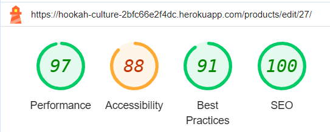

# Hookah Culture Testing

[Back to the README.md file](https://github.com/Delfinistkata/hookah_culture/blob/main/README.md#hookah-culture)  

[Back to the Testing section in the README.md file](https://github.com/Delfinistkata/hookah_culture/blob/main/README.md#testing)

[View live website here](https://hookah-culture-2bfc66e2f4dc.herokuapp.com/)  

## Table of Contents

1. [Testing User Stories](#testing-user-stories)
2. [Code Validation](#code-validation)
3. [Accessibility](#accessibility)
4. [Tools Testing](#tools-testing)
5. [Manual Testing](#manual-testing)

## Testing User Stories

User Stories are documented in the Hookah Culture [GitHub Projects Board](https://github.com/users/Delfinistkata/projects/5). User Stories are completed, with Acceptance Criteria and Tasks detailed within. Testing was carried out on Dev Tools for desktop/tablet/mobile, by creating multiple accounts for test users: Test01, Test02, Test03 etc and following through by ensuring that the Acceptance Criteria were met. All features were tested to ensure that they provided the user with the expected output and action.

| User Story                 | Acceptance Criteria Met?  | Tested | Response     | Pass/Fail | Fix     |
|----------------------------|---------------------------|--------|--------------|-----------|---------|
| As a **customer**, I can **view the site's home page** so that I can **understand the site's intentions and purpose**. | Yes | Yes | Home page is visible | Pass | n/a |
| As a **customer**, I can **see and use the navigation bar** so that I can **make my way around the site and get to where I would like**. | Yes | Yes | Navbar visible to all users in desktop/tablet and mobile views | Pass | n/a |
| As a **customer**, I can **enter text into the search bar** so that I can **search for a specific item**. | Yes | Yes | Search bar accepts user input and returns search results when search form is submitted | Pass | n/a |
| As a **customer** I can **create and manage an account** so that I can **keep my personal details, order history and speed up my checkout process**. | Yes | Yes | Register form takes new user information, sends verification email link to confirm account. User may then sign in to view their account, edit their personal information and start saving their order histories from purchases made | Pass | n/a |
| As a **customer**, I can **edit my personal details on my account** so that I can **keep them up to date**. | Yes | Yes | User information is editable | Pass | n/a |
| As a **site user**, I can **enter my login details** so that I can **login in to my account**. | Yes | Yes | User may login with correct details | Pass | n/a |
|  As a **site user**, I can **click on the visible links in the footer** so that I can **view the relevant information and destinations**. | Yes | Yes | Footer links return user to relevant area in website and external links open in a new tab | Pass | n/a |
| As a **site user**, I can **register my email and receive a validation link via email** so that I can **create an account with Hookah Culture to track my spending and purchases**. | Yes | Yes | Registration process works as expected to accept new users | Pass | n/a |
| As a **customer**, I can **use the Contact Us form** so I can **send a message to the business/site admin**. | Yes | Yes | Contact form, accepts user input, submits form and returns thank you page for user, and email to Hookah Culture Admin's inbox. | Pass | n/a |
| As a **site user** I can **interact with sorting and view features on the 'All Products' page** so that I can **improve my shopping experience on the site**. | Yes | Yes | Price, category, A-Z, rating works as expected to display products in a certain order. | Pass | n/a |
| As a **site user**, I can **click on a navbar item for a specific category** so that I can **choose to view a smaller amount of related products**. | Yes | Yes | Products sorted correctly into categories. | Pass | n/a |
| As a **customer**, I can **choose an individual product** so that I can **view its description, price, rating, review and stock available etc**. | Yes | Yes | Individual products returned when clicked on, all relevant information displayed and is interactable. | Pass | n/a |
| As a **site admin** I can **add a product to my inventory using a frontend form** so that I can **increase my range/amount of products available on site**. | Yes | Yes | Add product form takes new information and displays it in the product template correctly. | Pass | n/a |
| As a **site admin**, I can **edit existing inventory from a frontend form** so I can **change the quantity of stock, products description, price or image**. | Yes | Yes | Edit product form takes user input and returns it correctly in the template. | Pass | n/a |
| As a **site admin**, I can **delete products from the inventory using a frontend form** so that I can **remove it from sale**. | Yes | Yes | Delete product modal appears when clicked on and delete confirmation is needed before product is removed from database. | Pass | n/a |
| As a **customer** I can **create and manage an account with Hookah Culture** so that I can **keep my personal details, order history and speed up my checkout process**. | Yes | Yes | Account functions as expected, all user information is handled appropriately and displayed within the account template | Pass | n/a |
| As a **customer**, I can **click on 'Cart Icon' in my product view**so that I can **add the product to my cart**. | Yes | Yes | Cart icon works when clicked and product is added to shopping cart and displayed in a success toast with the product displayed. A link to the cart is displayed in the toast message. | Pass | n/a |
| As a **customer**, I can **increase/decrease/remove/update quantities of a product in my cart** so that I can **have control over what I wish to purchase**. | Yes | Yes | Increment/Decrement/Remove/Update buttons work as expected when clicked by user. | Pass | n/a |
| As a **customer**, I can **view my cart total from any page** so that I can **keep track of my potential spending**. | Yes | Yes | Cart item price is displayed in top right of shopping cart icon in navbar. | Pass | n/a |
| As a **customer**, I can **checkout my products securely** so that I can **complete my purchase**. | Yes | Yes | Payments handled correctly through Stripe's payment system, tested many times using the '4242424242...' Stripe testing card credentials. | Pass | n/a |
| As a **customer**, I can **receive an email after purchasing** so that I can **confirm my purchase and keep a record of my order**. | Yes | Yes | Email is delivered to customer after making a purchase. |Pass | n/a |
| As a **site user** I can **view error pages with 'Home' links** so that I can **return to the main page if a page is missing or forbidden**. | Yes | Yes | Error pages display correctly when user attempts to access non-existent content, restricted content. | Pass | n/a |
|  As a **logged-in user** I can **click the 'Heart Icon' button** to add to wishlist so that I can **keep a record of my favourite items**. | Yes | Yes | Add to wishlist button works for logged in user. | Pass | n/a |
|  As a **logged-in user** I can **click the 'Trash' icon beside my Wishlist item** so that I can **remove that product from my Wishlist**. | Yes | Yes | Remove button eliminates product from user's wishlist | Pass | n/a |
| As a **customer**, I can **enter my details into the newsletter form** so I can **receive emails about the latest products and deals**. | Yes | Yes | Newsletter form in the footer, the user enters their email and can successfully register for the newsletters, also receives toasts confirmation. | Pass | n/a |

[Back to top ⇧](#hookah-culture-testing)

## Code Validation

### HTML

* No errors were returned when passing through the [W3C Markup Validator](https://validator.w3.org/) validator.

### CSS
* [W3C CSS Validator](https://jigsaw.w3.org/css-validator/) found no errors on my CSS files.

### Python

Pylint was used continuously during the development process to analyze the Python code for programming errors.

The code was then checked for errors via the terminal command "python3 -m flake8". This returned a number of whitespace and indentation errors which were rectified where possible. (The unfixed errors were situated in root files such as .vscode/artictern)

Other errors regarding unused imports were corrected by removing the unnecessary files.

### Javascript

* [JSHint](https://jshint.com/) found no errors on my JS files.

[Back to top ⇧](#hookah-culture-testing)

## Accessibility

Lighthouse in Chrome DevTools has been used to confirm that the colors and fonts being used throughout the website are easy to read and accessible. See reports in the table below:

### Lighthouse Reports

Page | Lighthouse Report |
| --- | --- |
| Home |  |
| Products |  |
| Product Details |  |
| Add Product |  |
| Edit Product |  |
| Shopping Cart !|  |
| Checkout |  |
| Checkout Success |  |
| Profile |  |
| Wishlist |  |
| Reviews |  |
| Add Review |  |
| Edit Review |  |
| Contact Us |  |

[Back to top ⇧](#hookah-culture-testing)

## Tools Testing

### [Chrome DevTools](https://developer.chrome.com/docs/devtools/)

* Chrome DevTools was used during the development process to test, explore and modify HTML elements and CSS styles used in the project.

### Responsiveness

* Chrome DevTools was used to test responsiveness in different screen sizes during the development process.

[Back to top ⇧](#hookah-culture-testing)

## Manual Testing

### Browser Compatibility

Browser | Outcome | Pass/Fail | 
--- | --- | --- |
Google Chrome | No appearance, responsiveness nor functionality issues. | Pass |
Safari | No appearance, responsiveness nor functionality issues. | Pass |
Mozilla Firefox | No responsiveness nor functionality issues. | Pass |
Microsoft Edge | No appearance, responsiveness nor functionality issues. | Pass |

[Back to top ⇧](#hookah-culture-testing)

### Device Compatibility

Device | Operative System |Outcome | Pass/Fail
--- | --- | --- | --- |
MacBook Pro 15" | macOS Big Sur | No appearance, responsiveness nor functionality issues. | Pass |
iPad Pro | iOS 17 | No appearance, responsiveness nor functionality issues. | Pass |
iPad Air | iOS 17 |No appearance, responsiveness nor functionality issues. | Pass |
iPhone 14 Pro Max | iOS 17 |No appearance, responsiveness nor functionality issues. | Pass |
iPhone 12 Pro | iOS 17 |No appearance, responsiveness nor functionality issues. | Pass |
iPhone XR | iOS 17 |No appearance, responsiveness nor functionality issues. | Pass |
iPhone SE | iOS 17 |No appearance, responsiveness nor functionality issues. | Pass |

[Back to top ⇧](#hookah-culture-testing)

### Test Results

#### General

Element | Expected Outcome | Pass/Fail |
--- | --- | --- |
Main Logo Link | Clicking the link redirects to the home page. | Pass |
Shop Link | Clicking the link redirects to the products page. | Pass |
Contact Us Link | Clicking the link redirects to contact page. | Pass |
Register Link | Clicking the link redirects to the account sign up page. | Pass |
Login Link | Clicking the link redirects to the account sign in page. | Pass |
Shopping Cart Icon | Clicking the link redirects to the shopping cart. | Pass |
My Account Icon - Wishlist Link | Clicking the link redirects to the wishlist page. | Pass |
My Account Icon - Contact Us Link | Clicking the link redirects to the contact us page. | Pass |
My Account Icon - Logout link | Clicking the link redirects to the account sign out page. | Pass |
My Account Icon - Product Management Link | Clicking the link redirects to the add product page. | Pass |
My Account Icon - Profile Link | Clicking the link redirects to the profile page. | Pass |
My Account Icon - Reviews Link | Clicking the link redirects to the reviews page. | Pass |
Search Bar | Clicking the link redirects to the products page and display the matching products. | Pass |
Privacy Policy Link | Clicking the link opens the privacy policy. | Pass |
Facebook Icon | Clicking the link opens the business Facebook page on a separate tab. | Pass |
LinkedIn Icon | Clicking the link opens the owner's LinkedIn page on a separate tab. | Pass |
Github Icon | Clicking the link opens the owner's Github page on a separate tab. | Pass |
Newsletter Form | Email address gets registered to the database when submitting the form. | Pass |

#### Home Page

Element | Expected Outcome | Pass/Fail |
--- | --- | --- |
Categories Links | Clicking any of the links will redirect to the products page and filter the products on that category. | Pass |
Down Arrow Link | Clicking the link redirects to about section in the home page. | Pass |

#### Products Page

Element | Expected Outcome | Pass/Fail |
--- | --- | --- |
Product Navigation Bar Links | Clicking any of the links will filter the products on that category. | Pass |
Sort By Selector | Sort by functionality sort the products depending on the selection. | Pass |
Heart Icon | Clicking the icon adds the product to wishlist and redirects to product detail page. | Pass |
Product Image | Clicking the image redirects to the product details page for that specific product. | Pass |

#### Product Details Page

Element | Expected Outcome | Pass/Fail |
--- | --- | --- |
Product Navigation Bar Links | Clicking any of the links will redirect to the products page and filter the products on that category. | Pass
Empty Heart Icon | Clicking the icon adds the product to wishlist and the heart is filled. | Pass |
Filled Heart Icon | Clicking the icon removes the product from wishlist and redirects to wishlist. | Pass |
Product Edit Link | Clicking the link redirects to the edit product page. | Pass |
Product Delete Link | Clicking the link deletes the product from the database. | Pass |
Decrease Quantity Button | Decreases the quantity on the input form. | Pass |
Increase Quantity Button | Increases the quantity on the input form. | Pass |
Cart Icon | Clicking the icon adds the specified quantity of the product to the shopping cart. | Pass |
Reviews Link | Clicking the link toggle the product reviews. | Pass |
Add Review Link | Clicking the link redirects to the add review page. | Pass |
Product Edit Link | Clicking the link redirects to the edit product page. | Pass |
Product Delete Link | Clicking the link delete the product from the database. | Pass |

#### Add Product Page

Element | Expected Outcome | Pass/Fail |
--- | --- | --- |
Select Image Button | Clicking the button allows to add an image to the form | Pass |
Add Product Form | Product gets registered to the database when submitting the form. | Pass |
Cancel Button | Clicking the button redirects to the products page. | Pass |

#### Edit Product Page

Element | Expected Outcome | Pass/Fail |
--- | --- | --- |
Select Image Button | Clicking the button allows to add or replace the image | Pass |
Edit Product Form | Product gets updated when submitting the form and redirects back to product detail page. | Pass |
Cancel Button | Clicking the button redirects to the products page. | Pass |

#### Shopping Cart Page

Element | Expected Outcome | Pass/Fail |
--- | --- | --- |
Decrease Quantity Button | Decreases the quantity on the input form. | Pass |
Increase Quantity Button | Increases the quantity on the input form. | Pass |
Update icon | Clicking the icon updates the product quantity in the shopping cart. | Pass
Delete icon | Clicking the icon removes the product from the shopping cart. | Pass
Continue Shopping Link | Clicking the link redirects to the products page. | Pass |
Secure Checkout Button | Clicking the button redirects to the checkout page. | Pass |

#### Checkout Page

Element | Expected Outcome | Pass/Fail |
--- | --- | --- |
Checkout Form | An order gets created when submitted the form. | Pass |
Login Link | Clicking the link redirects to the account sign in page. | Pass |
Register Link | Clicking the link redirects to the account sign up page. | Pass |
Save Information Check | Checking the box update the user's profile information during the checkout process. | Pass |
Adjust Bag Link | Clicking the link redirects to shopping bag page. | Pass |

#### Checkout Success Page

Element | Expected Outcome | Pass/Fail |
--- | --- | --- |
Latest Deals Button | Clicking the button redirects to the latest offers page. | Pass |

#### Profile Page

Element | Expected Outcome | Pass/Fail |
--- | --- | --- |
Update Information Form | User's information gets updated when submitting the form. | Pass |
Order Link | Clicking the link redirects to order view. | Pass |

#### Wishlist Page

Element | Expected Outcome | Pass/Fail |
--- | --- | --- |
Delete icon | Clicking the icon removes the product from the user's wishlist. | Pass |
Continue Shopping button | Clicking the button redirects to the products page when the wishlist is empty. | Pass |

#### Reviews Page

Element | Expected Outcome | Pass/Fail |
--- | --- | --- |
Product Image | Clicking the image redirect to the product details page. | Pass |
Sandwich dropdown menu | Clicking the dropdown menu shows the links for edit and delete review. | Pass |
Edit Link | Clicking the link redirect to the edit review page. | Pass |
Delete Link | Clicking the link deletes the review from the database. | Pass |

#### Add Review Page

Element | Expected Outcome | Pass/Fail |
--- | --- | --- |
Add Review Form | Review gets registered to the database when submitting the form. | Pass |
Cancel Button | Clicking the button redirects to the product details page. | Pass |

#### Edit Review Page

Element | Expected Outcome | Pass/Fail |
--- | --- | --- |
Edit Review Form | Review gets updated when submitting the form. | Pass |
Cancel Button | Clicking the button redirects to the products page. | Pass |

#### Contact Us Page

Element | Expected Outcome | Pass/Fail |
--- | --- | --- |
Contact Us Form | Information gets suubmitted when the form is correctly filled in. | Pass |
Submit Button |  The form is submitted when the button is clicked. | Pass |

[Back to top ⇧](#hookah-culture-testing)